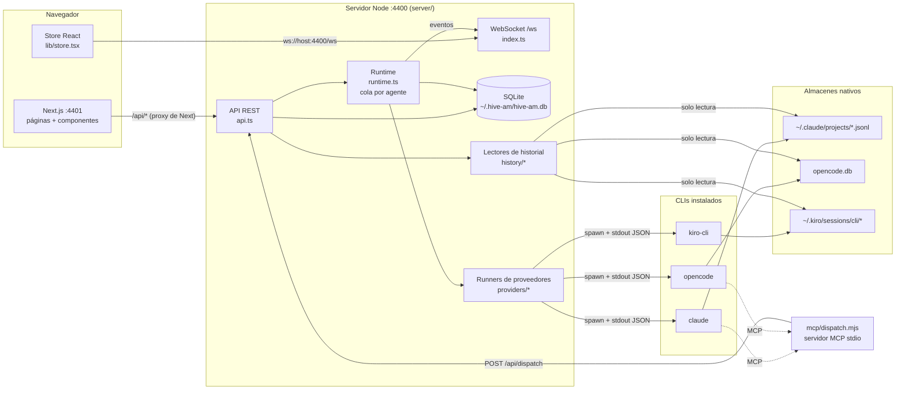

# 1. Visión general

## Qué es

hive-am es una aplicación local (servidor Node + interfaz web en Next.js) que **gestiona sesiones de agentes de código** ejecutando los CLIs oficiales como procesos hijos:

- **Claude Code** (`claude`)
- **OpenCode** (`opencode`)
- **Kiro** (`kiro-cli`)

Un agente es una configuración (proveedor, modelo, prompt, permisos, carpeta, skills) más un **puntero** a una sesión nativa del CLI. La conversación en sí **nunca se copia ni se resume** en la base de datos de hive-am: vive en el almacén propio de cada CLI y se vuelve a leer desde allí.

## Principios de diseño

1. **La conversación es del CLI, no de hive-am.** hive-am guarda `proveedor + session_id + carpeta`. Tras un apagón basta relanzar el CLI con `--resume`/`-s`/`--resume-id`; no hay resúmenes ni reconstrucciones.
2. **Sin ACP.** Cada turno es un proceso `claude -p`, `opencode run` o `kiro-cli chat --no-interactive` con salida JSON por líneas.
3. **Un turno = un proceso.** No hay procesos residentes por agente. Esto simplifica la recuperación: si hive-am cae, no queda nada colgado salvo el turno en vuelo.
4. **El historial se lee, no se persiste.** Tres lectores (uno por proveedor) normalizan los formatos nativos a un mismo formato de mensajes.
5. **Delegación explícita.** Un orquestador solo puede delegar a los subagentes conectados directamente a él. Cada delegación abre una sesión nueva del subagente.
6. **Herencia opcional por colonia.** Una colonia presta carpeta, permisos, skills y contexto; el proveedor y el modelo nunca se heredan.
7. **Local y de un solo usuario.** El servidor escucha solo en `127.0.0.1` y no tiene autenticación (ver [documento 12](12-operacion-y-problemas.md)).

## Arquitectura

### Responsabilidades por capa

| Capa | Archivos | Responsabilidad |
|---|---|---|
| Presentación | `web/` | Páginas, formularios, chat, panal, lienzo de relaciones |
| API | `server/src/api.ts` | Validación, rutas REST, orquestación de las demás capas |
| Tiempo real | `server/src/index.ts`, `runtime.ts` (`bus`) | Difunde eventos por WebSocket |
| Ejecución | `server/src/runtime.ts`, `instructions.ts` | Cola por agente, sesiones y delegación; composición de instrucciones y herramientas de cada agente |
| Proveedores | `server/src/providers/` | Construye el comando de cada CLI y traduce su salida a eventos comunes |
| Historial | `server/src/history/` | Lee las conversaciones guardadas por cada CLI |
| Datos | `server/src/db.ts` | Esquema SQLite, migraciones, acceso a datos |
| Herramientas MCP | `server/mcp/dispatch.mjs` | Servidor `hive`: `list_agents` y `dispatch` (orquestadores), `channel_reply`, `channel_send_file` y `channel_mute` (conexiones), `notebook_*` (cuaderno) y `skill_read` (skills a demanda) |

## Glosario

| Término | Significado |
|---|---|
| **Agente** | Configuración + puntero a una sesión nativa. Puede ser **orquestador** o **worker**. |
| **Orquestador** (*queen*) | Agente que planifica y delega con la herramienta `dispatch`. |
| **Worker / subagente** | Agente que hace el trabajo; recibe tareas del usuario o de un orquestador. |
| **Tipo de agente** | Plantilla reutilizable (proveedor, modelo, prompt, permisos, skills) para crear agentes. |
| **Skill** | Bloque de instrucciones en markdown que se agrega al prompt de un agente o tipo. |
| **Colonia** | Grupo de agentes con valores por defecto compartidos (carpeta, permisos, skills, contexto). Se dibuja como una región en el panal. |
| **Panal** (*comb*) | Mapa hexagonal de la pantalla Colony: una celda por agente. |
| **Sesión nativa** | Conversación guardada por el propio CLI (identificada por un `session_id`). |
| **Sesión directa** | La conversación del usuario con un agente. |
| **Sesión de delegación** | Sesión nueva que se abre cada vez que un orquestador delega una tarea. |
| **Turno** | Una ejecución del CLI: un mensaje del usuario (o tarea delegada) y la respuesta completa del agente. |
| **Runner** | Función que ejecuta un turno para un proveedor y produce eventos (`StreamEvent`). |
| **Permiso** | Nivel de acceso del agente: `plan` (solo lectura), `acceptEdits`, `bypassPermissions`. |
| **Carpeta efectiva** | Carpeta donde realmente corre el agente (propia o heredada de la colonia). |

## Flujo de vida de un mensaje (resumen)

1. El usuario escribe en el chat → `POST /api/agents/:id/messages`.
2. El servidor encola el turno en la cola del agente y responde `{ accepted: true }`.
3. El runtime resuelve la configuración efectiva, compone las instrucciones y lanza el runner del proveedor.
4. El runner arranca el CLI y traduce su salida a eventos (`text`, `thinking`, `tool`, `tool_result`, `usage`, `done`, `error`).
5. Cada evento se difunde por WebSocket; el navegador los muestra en vivo.
6. Al terminar, el navegador relee el historial nativo, que ya incluye el turno completo.

El detalle completo está en el [documento 5](05-comunicacion-back-front.md).
