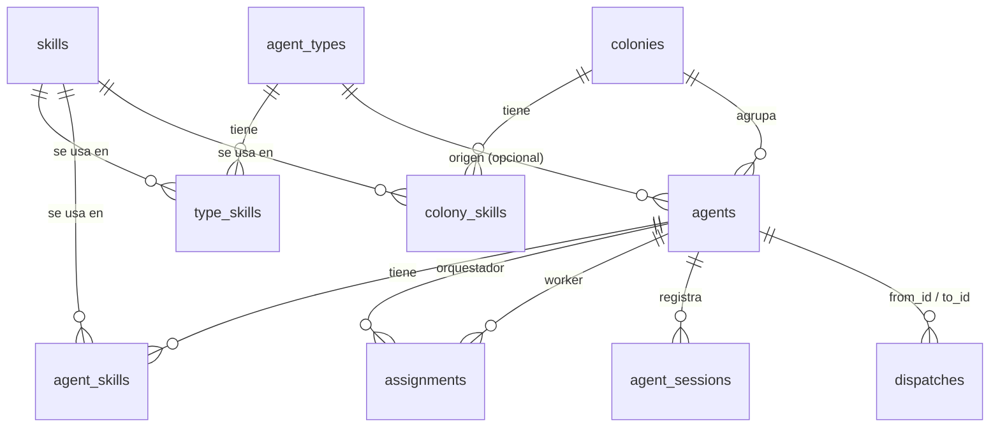

# 4. Almacenamiento

hive-am guarda datos en **cuatro** lugares. Entender cuál guarda qué es clave:

| Lugar | Quién lo escribe | Qué contiene |
|---|---|---|
| `~/.hive-am/hive-am.db` | hive-am | Configuración: agentes, tipos, skills, colonias, relaciones, punteros a sesiones, registro de delegaciones |
| `~/.hive-am/mcp/<agentId>.json` | hive-am | Configuración MCP temporal por agente (solo Claude) |
| Almacenes nativos de cada CLI | **cada CLI** | Las **conversaciones** (mensajes, herramientas, uso de tokens) |
| `localStorage` del navegador | la interfaz | Preferencias de vista (tema, panel, posiciones del lienzo) |

> **Regla central:** la conversación no se copia a la base de hive-am. La base solo sabe *qué sesión* usa cada agente.

## 4.1 Base de datos SQLite: `~/.hive-am/hive-am.db`

- Motor: `better-sqlite3` (síncrono).
- Ubicación: `$HIVE_AM_HOME/hive-am.db` (por defecto `~/.hive-am/`).
- Pragmas: `journal_mode = WAL` y `foreign_keys = ON`. Con WAL aparecen también `hive-am.db-wal` y `hive-am.db-shm`; es normal.
- Los identificadores son UUID v4 en texto. Las fechas son milisegundos Unix (`Date.now()`).
- El esquema se crea con `CREATE TABLE IF NOT EXISTS` al importar `db.ts`, y después se aplican **migraciones ligeras** (`ALTER TABLE … ADD COLUMN` si la columna falta). Esas migraciones corren siempre, también en bases nuevas, por eso algunas columnas no aparecen en el `CREATE TABLE` inicial.

### Diagrama de relaciones



### Tabla `skills`

| Columna | Tipo | Notas |
|---|---|---|
| `id` | TEXT PK | UUID |
| `name` | TEXT, UNIQUE | Nombre único |
| `description` | TEXT | Una línea |
| `content` | TEXT | Markdown con las instrucciones |
| `created_at`, `updated_at` | INTEGER | ms |

### Tabla `agent_types`

Plantillas de agente.

| Columna | Notas |
|---|---|
| `id`, `name` (UNIQUE), `description` | |
| `role` | `orchestrator` \| `worker` |
| `provider` | `claude` \| `opencode` \| `kiro` |
| `model` | Texto libre; vacío = valor por defecto del CLI |
| `system_prompt` | |
| `permission` | `plan` \| `acceptEdits` \| `bypassPermissions` (por defecto `acceptEdits`) |
| `color` | Reservado; hoy solo se rellena en el seed |
| `created_at` | |

Tabla puente `type_skills (type_id, skill_id)`, ambas con `ON DELETE CASCADE`.

### Tabla `agents`

| Columna | Notas |
|---|---|
| `id`, `name` (UNIQUE, sin distinguir mayúsculas al buscar por nombre), `description` | |
| `role` | `orchestrator` \| `worker` |
| `type_id` | FK a `agent_types`, `ON DELETE SET NULL`. Solo informativa: el agente es una copia, no sigue a su tipo |
| `provider`, `model`, `system_prompt`, `permission` | Configuración propia del agente |
| `cwd` | Carpeta propia. Puede ser `''` si hereda la de la colonia |
| `session_id` | **Puntero** a la sesión directa actual (id nativo del CLI) |
| `session_cwd` | Carpeta con la que se creó esa sesión (migración) |
| `instr_hash` | Huella de las instrucciones que recibió esa sesión (migración) |
| `status` | `idle` \| `running` \| `error` |
| `colony_id` | FK a `colonies`, `ON DELETE SET NULL` (migración) |
| `overrides` | JSON: campos donde el agente ignora a su colonia, p. ej. `["cwd","skills"]` (migración) |
| `created_at`, `updated_at` | |

Tablas puente:

- `agent_skills (agent_id, skill_id)`: skills propias del agente (`CASCADE` en ambos lados).
- `assignments (orchestrator_id, worker_id)`: **relaciones** de delegación (`CASCADE`). Es la fuente de verdad de qué orquestador puede delegar a qué worker.

### Tabla `colonies`

| Columna | Notas |
|---|---|
| `id`, `name` (UNIQUE), `color` | `color` es un hex como `#2f8f5b` |
| `cwd` | Carpeta compartida |
| `permission` | Permiso compartido |
| `system_prompt` | Contexto compartido |
| `inherit` | JSON `{ "cwd": bool, "permission": bool, "skills": bool, "prompt": bool }`: qué campos siguen los miembros por defecto |
| `created_at` | |

Tabla puente `colony_skills (colony_id, skill_id)` (`CASCADE`). La pertenencia de agentes a la colonia se guarda en `agents.colony_id` (un agente pertenece como máximo a una colonia).

### Tabla `agent_sessions`

Bitácora de **todas** las sesiones nativas que un agente ha usado. Alimenta las pestañas y pantallas de Sessions.

| Columna | Notas |
|---|---|
| `agent_id`, `session_id` | Clave primaria compuesta |
| `provider` | Proveedor con el que se creó |
| `cwd` | Carpeta efectiva con la que corrió |
| `first_seen`, `last_seen` | ms |
| `kind` | `direct` (conversación del usuario) \| `delegation` (tarea de un orquestador) |
| `from_id` | Orquestador que delegó (solo `delegation`) |
| `task` | Texto de la tarea, recortado a 500 caracteres (solo `delegation`) |

### Tabla `dispatches`

Registro de delegaciones: quién pidió qué a quién.

| Columna | Notas |
|---|---|
| `id` | UUID |
| `from_id`, `to_id` | Orquestador y worker (sin clave foránea: el registro sobrevive si se borra un agente) |
| `task` | Texto completo de la tarea |
| `status` | `running` \| `done` \| `failed` \| `interrupted` |
| `result` | Respuesta final del worker, recortada a 20 000 caracteres |
| `session_id` | Sesión nativa del worker donde se ejecutó (migración) |
| `created_at`, `finished_at` | |

### Datos iniciales (seed)

`server/src/seed.ts` se ejecuta en cada arranque pero **solo actúa si no hay tipos, agentes ni skills**. Crea:

- Skills: `concise-reports`, `careful-reviewer`.
- Tipos: **Queen** (orquestador, Claude/sonnet), **Builder** (worker, Claude/sonnet), **Reviewer** (worker, OpenCode, permiso `plan`).

### Integridad y borrados

| Acción | Efecto |
|---|---|
| Borrar un agente | Se eliminan sus skills propias, sus asignaciones (como orquestador y como worker) y su bitácora de sesiones. **Los archivos nativos de las sesiones no se tocan.** |
| Borrar una colonia | Sus agentes quedan sin colonia (`colony_id = NULL`) y dejan de heredar. |
| Borrar un tipo | Los agentes creados desde él conservan sus valores; `type_id` pasa a `NULL`. |
| Borrar una skill | Se desvincula de agentes, tipos y colonias. |

## 4.2 Archivos de configuración MCP: `~/.hive-am/mcp/<agentId>.json`

Solo para **Claude** y solo cuando el agente es orquestador con al menos un subagente. En cada turno se reescribe con:

```json
{ "mcpServers": { "hive": { "command": "<node>", "args": ["…/server/mcp/dispatch.mjs"],
  "env": { "HIVE_AGENT_ID": "<id>", "HIVE_AM_API": "http://127.0.0.1:4400" } } } }
```

Se pasa a Claude con `--mcp-config`. OpenCode recibe la misma información por la variable de entorno `OPENCODE_CONFIG_CONTENT` (no escribe archivo).

## 4.3 Almacenes nativos de los CLIs (solo lectura para hive-am)

hive-am **lee** estos archivos para mostrar el historial; nunca los modifica.

| Proveedor | Ubicación | Formato |
|---|---|---|
| Claude Code | `~/.claude/projects/<carpeta-codificada>/<sessionId>.jsonl` | JSONL, una línea por bloque de contenido. La carpeta codificada reemplaza `/` y `.` por `-`. Si no se encuentra en la carpeta esperada, se busca en todas las carpetas de proyecto. |
| OpenCode | `~/.local/share/opencode/opencode.db` | SQLite, tablas `session_v2` (metadatos, `directory`) y `session_message` (mensajes). Se abre en modo `readonly`. |
| Kiro | `~/.kiro/sessions/cli/<sessionId>.jsonl` y `<sessionId>.json` | `.jsonl`: mensajes (`Prompt`, `AssistantMessage`, …). `.json`: metadatos de sesión, incluido el medidor por turno (créditos, duración, % de contexto). |

Detalle de cada lector en el [documento 8](08-sesiones-e-historial.md).

## 4.4 `localStorage` del navegador

Solo preferencias de vista; si se borran, la interfaz funciona igual.

| Clave | Valor | Dónde se usa |
|---|---|---|
| `hive-theme` | `light` \| `dark` | `Shell.tsx`: tema elegido (si no existe, se sigue el del sistema) |
| `hive-cfg-open` | `1` \| `0` | `agents/[id]/page.tsx`: si el panel de ajustes del agente queda abierto |
| `hive-rel-pos-v2` | JSON `{ id: {x, y} }` | `relations/page.tsx`: posiciones de nodos que arrastraste a mano |

La clave anterior `hive-rel-pos` ya no se usa (se abandonó al rediseñar el lienzo).

## 4.5 Lo que **no** se guarda

- Mensajes, respuestas, llamadas a herramientas y su salida (están en el almacén nativo).
- Tokens y costos (se calculan al leer el historial).
- Cookies o credenciales: hive-am no autentica; los CLIs usan su propia sesión iniciada.
