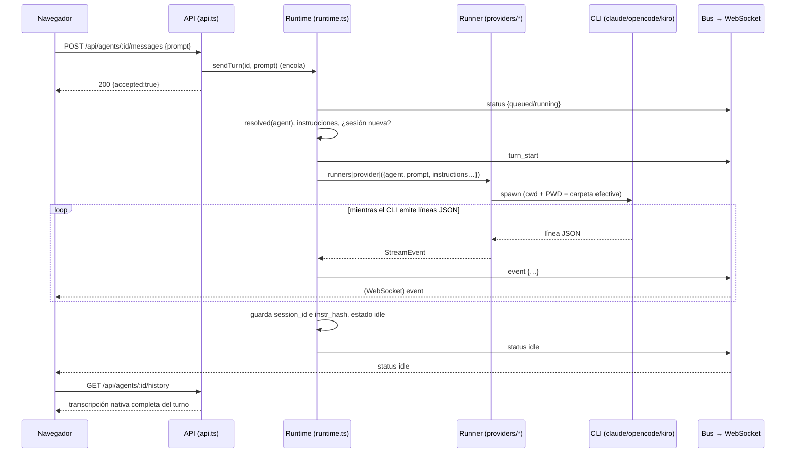

# 5. Comunicación entre backend y frontend

El navegador habla con el servidor por **dos canales**:

| Canal | Para qué | Dirección |
|---|---|---|
| **HTTP REST** (`/api/*`) | Leer y modificar datos; enviar mensajes; detener turnos | Petición/respuesta |
| **WebSocket** (`/ws`) | Recibir en vivo lo que ocurre (tokens, herramientas, cambios de estado) | Solo servidor → navegador |

El navegador **no envía** nada por el WebSocket: todas las acciones son peticiones HTTP.

## 5.1 Camino de red

```
Navegador (localhost:4401)
   │  fetch('/api/...')            ← mismo origen que la página
   ▼
Next.js (4401)  ── rewrites() ──▶  http://127.0.0.1:4400/api/...   (servidor hive-am)

Navegador ── WebSocket directo ──▶ ws://<hostname>:4400/ws
```

- `web/next.config.mjs` define un `rewrites()` que reenvía `/api/:path*` a `${HIVE_AM_API}/api/:path*` (por defecto `http://127.0.0.1:4400`). Por eso el front llama a rutas relativas y no hay problemas de CORS en uso normal.
- El WebSocket **no pasa por el proxy**: `lib/store.tsx` abre `ws://${location.hostname}:${NEXT_PUBLIC_HIVE_WS_PORT ?? 4400}/ws`.
- El servidor responde `Access-Control-Allow-Origin: *` (y métodos `GET,POST,PATCH,PUT,DELETE,OPTIONS`) y contesta `204` a `OPTIONS`. Está pensado para uso local; ver seguridad en el [documento 12](12-operacion-y-problemas.md).

## 5.2 Convenciones de la API REST

- Todas las respuestas son JSON (`content-type: application/json`), también las de error.
- Éxito: **HTTP 200** con el objeto resultante (las altas también devuelven 200, no 201). Algunas rutas devuelven `null` si no hay dato (p. ej. `/live` sin turno).
- Error de validación: **400** `{ "error": "mensaje" }`. No encontrado: **404** `{ "error": "…" }`. Ruta inexistente: **404** `{ "error": "No such route" }`. Fallo interno: **500** `{ "error": "Unexpected server error" }`.
- El cuerpo debe ser JSON válido; si no, 400 `Request body is not valid JSON`.
- El cliente (`web/lib/api.ts`) expone `api.get/post/patch/put/del`; ante un estado no-OK lanza `ApiError` con el mensaje del servidor, que la interfaz muestra tal cual en un aviso.
- El enrutador (`api.ts`) convierte `:param` en un grupo de captura de expresión regular; no hay middlewares.

## 5.3 Referencia de endpoints

### Salud y proveedores

| Método y ruta | Respuesta |
|---|---|
| `GET /api/health` | `{ ok: true }` |
| `GET /api/providers` | `[{ id, label, installed, version }]`. Ejecuta `<cli> --version` (tiempo máx. 8 s). Caché de 60 s. |
| `GET /api/providers/:p/models` | `[{ id, label }]`. Caché de 10 min por proveedor. Puede devolver `[]` si el CLI no listó modelos. |

### Agentes

| Método y ruta | Cuerpo | Respuesta / notas |
|---|---|---|
| `GET /api/agents` | — | Lista de agentes con `queued` (mensajes en cola) y `live` (¿hay turno en curso?). Cada agente incluye `effective` (valores ya resueltos con la colonia). |
| `POST /api/agents` | `name`, `role`, `provider`, `cwd`, y opcionales `description`, `model`, `system_prompt`, `permission`, `skill_ids`, `worker_ids`, `type_id`, `colony_id`, `overrides` | El agente creado. 400 si falta el nombre, el proveedor/rol es inválido, la carpeta no existe, el nombre ya existe o no queda ninguna carpeta efectiva. |
| `GET /api/agents/:id` | — | Un agente. |
| `PATCH /api/agents/:id` | Cualquier subconjunto de los campos anteriores | El agente actualizado. Si cambia el `provider`, se descarta la sesión actual. |
| `DELETE /api/agents/:id` | — | Detiene su turno en curso y lo elimina. `{ ok: true }` |
| `POST /api/agents/:id/messages` | `{ prompt }` | **Encola** el turno y responde de inmediato `{ accepted: true }`. El resultado llega por WebSocket. |
| `POST /api/agents/:id/stop` | — | Aborta el turno en curso. `{ stopped: bool }` |
| `POST /api/agents/:id/new-session` | — | Detiene el turno y borra el puntero de sesión: el siguiente mensaje abre una conversación nueva. |
| `POST /api/agents/:id/resume-session` | `{ session_id }` | Hace actual una sesión **directa** anterior del agente. 400 si no es suya o es de delegación. |
| `GET /api/agents/:id/history?session=<id>` | — | `{ session_id, messages: ChatMessage[] }`. Sin `session`, usa la actual. 400 si la sesión no pertenece al agente. |
| `GET /api/agents/:id/stats?session=<id>` | — | `SessionStats` (ver [documento 10](10-chat-y-visualizacion.md)). |
| `GET /api/agents/:id/live` | — | Turno en curso `{ turnId, prompt, events[], source }` o `null`. |
| `GET /api/agents/:id/sessions` | — | Filas de `agent_sessions` (con `from_name` en las delegaciones). |

### Sesiones de todos los agentes

| Método y ruta | Respuesta |
|---|---|
| `GET /api/sessions` | Todas las sesiones registradas, más `current`, `message_count`, `preview`, `usage`, `cost`, `tool_calls`, `model`. **Lee el historial de cada sesión** en cada llamada. |

### Explorador de cambios (git, solo lectura)

Ver el detalle en el [documento 13](13-explorador-de-cambios-git.md#134-api-solo-lectura).

| Método y ruta | Respuesta |
|---|---|
| `GET /api/agents/:id/git/status` | Rama, último commit y lista de cambios de la carpeta efectiva del agente |
| `GET /api/agents/:id/git/tree` | Todos los archivos (versionados + nuevos, sin ignorados) |
| `GET /api/agents/:id/git/diff?path=&old=` | Diff unificado de un archivo contra `HEAD` |
| `GET /api/agents/:id/git/file?path=` | Contenido de un archivo (o su versión de `HEAD` si fue borrado) |
| `GET /api/agents/:id/git/raw?path=` | Bytes de una imagen para la vista previa |

### Skills

| Método y ruta | Cuerpo | Respuesta |
|---|---|---|
| `GET /api/skills` | — | Lista |
| `GET /api/skills/usage` | — | `{ [skillId]: { agents, types } }` (cuenta agentes y tipos que la usan; **no** cuenta colonias) |
| `POST /api/skills` | `{ name, description?, content? }` | La skill. 400 si el nombre existe. |
| `PATCH /api/skills/:id` | subconjunto | La skill |
| `DELETE /api/skills/:id` | — | `{ ok: true }` |

### Tipos de agente

| Método y ruta | Cuerpo | Respuesta |
|---|---|---|
| `GET /api/types` | — | Lista (cada tipo con `skill_ids`) |
| `POST /api/types` | `name`, `role`, `provider` y opcionales `description`, `model`, `system_prompt`, `permission`, `skill_ids` | El tipo |
| `PATCH /api/types/:id` | subconjunto | El tipo |
| `DELETE /api/types/:id` | — | `{ ok: true }` |
| `POST /api/types/:id/spawn` | `{ name, cwd?, description?, colony_id? }` | Crea un **agente** copiando los valores del tipo |

### Colonias

| Método y ruta | Cuerpo | Respuesta |
|---|---|---|
| `GET /api/colonies` | — | Lista (con `skill_ids`, `agent_ids`, `inherit`) |
| `POST /api/colonies` | `name`, y opcionales `color`, `cwd`, `permission`, `system_prompt`, `skill_ids`, `inherit`, `agent_ids` | La colonia |
| `PATCH /api/colonies/:id` | subconjunto; `agent_ids` **reemplaza** la membresía | La colonia |
| `DELETE /api/colonies/:id` | — | `{ ok: true }` |

### Orquestación

| Método y ruta | Cuerpo | Respuesta |
|---|---|---|
| `GET /api/orchestrators/:id/workers` | — | `[{ name, role, description, provider, busy }]`: solo los subagentes **directos** (lo usa la herramienta `list_agents`) |
| `PUT /api/orchestrators/:id/workers` | `{ worker_ids }` | Reemplaza las conexiones del orquestador. 400 si el agente no es orquestador. |
| `POST /api/dispatch` | `{ from, agent, task }` | **Bloquea** hasta que el worker termina. Devuelve `{ ok, text, error? }`. 400 si no existe, no está asignado, etc. |
| `GET /api/dispatches` | — | Últimas 50 delegaciones |

### Utilidades

| Método y ruta | Respuesta |
|---|---|
| `GET /api/fs/dirs?path=<ruta>` | `{ path, parent, dirs: [{ name, path }] }` para el selector de carpetas (oculta carpetas que empiezan con `.` y `node_modules`; sin `path` usa tu carpeta personal). |

## 5.4 WebSocket: `ws://<host>:4400/ws`

Cada mensaje es un objeto JSON con un campo `kind`. Los genera el `bus` del runtime (`runtime.ts`).

| `kind` | Campos | Cuándo se emite |
|---|---|---|
| `turn_start` | `agentId`, `turnId`, `prompt`, `source` (`user` \| `dispatch`), `from?` | Al empezar a ejecutarse un turno (no al encolarlo). |
| `event` | `agentId`, `turnId`, `event` (un `StreamEvent`) | Por cada evento que produce el runner. |
| `status` | `agentId`, `status` (`idle` \| `running` \| `error` \| `queued`), `queued` | Al encolar, al empezar y al terminar un turno. |
| `agents_changed` | — | Cuando cambia el conjunto de agentes/colonias o una sesión (alta, edición, baja, nueva sesión, etc.). |

### Eventos de un turno (`StreamEvent`)

Son comunes a los tres proveedores (cada runner traduce su formato propio):

| `t` | Campos | Significado |
|---|---|---|
| `session` | `sessionId` | El CLI informó el id de su sesión (se guarda como puntero). |
| `text` | `delta` | Fragmento de texto de la respuesta. |
| `thinking` | `delta` | Fragmento de razonamiento. |
| `tool` | `id`, `name`, `input` | El agente invoca una herramienta. |
| `tool_result` | `id`, `output`, `error?` | Resultado de esa herramienta. |
| `usage` | `usage` (parcial), `cost?`, `model?`, `durationMs?` | Uso de tokens/créditos y costo. |
| `done` | `ok`, `summary?` | Fin correcto. |
| `error` | `message` | Fin con error. |

## 5.5 Flujo completo de un mensaje



Puntos importantes:

1. **La respuesta HTTP del POST no contiene la respuesta del agente**; solo confirma que se encoló.
2. El navegador pinta el turno en vivo a partir de los eventos del WebSocket. Es un estado temporal (`LiveTurn`).
3. Al llegar `status: idle` (o `error`), el store incrementa un contador `finished[agentId]`. El chat reacciona leyendo `GET …/history`: la transcripción nativa reemplaza al estado temporal.
4. Si el turno termina en `error`, el estado en vivo **se conserva** para que veas el mensaje, hasta que pulses *Dismiss*.

## 5.6 Estado en el navegador (`lib/store.tsx`)

`HiveProvider` mantiene en un reductor:

```
ready, connected,
agents[], types[], skills[], colonies[], providers[],
live: { [agentId]: LiveTurn },       // turno en curso
finished: { [agentId]: number }      // contador de turnos terminados
```

| Momento | Qué ocurre |
|---|---|
| Montaje | `refresh()` carga agentes, tipos, skills y colonias; aparte se piden los proveedores. |
| WebSocket abierto | `refresh(['agents'])`; luego, para cada agente con `live: true`, se pide `GET /live` y se **reconstruye** el turno con sus eventos acumulados. Así, recargar la página a mitad de un turno no pierde lo ya mostrado. |
| `agents_changed` | `refresh(['agents','colonies'])`. |
| `turn_start` | Crea un `LiveTurn` vacío para ese agente. |
| `event` | Pliega el evento en el `LiveTurn` (ver [documento 10](10-chat-y-visualizacion.md)). Ignora eventos de un `turnId` distinto al actual. |
| `status` | Actualiza estado y cola del agente. `queued` se muestra como `running`. En `idle` borra el `LiveTurn` y, si lo había, sube `finished`; en `error` lo conserva. |
| Cierre del socket | `connected = false`; reintenta con espera exponencial: `min(8000, 800 · 2^n)` ms. |

El estado de conexión se muestra al pie de la barra lateral ("Connected to server" / "Server offline — retrying").

## 5.7 Cómo se mantiene fresca la interfaz

- Los cambios hechos por esta pestaña, o por otra, llegan como `agents_changed` y fuerzan un `refresh`.
- Las pantallas que no escuchan eventos de forma directa (p. ej. *Recent delegations* en Colony) consultan periódicamente: `GET /api/dispatches` cada 6 s.
- El listado de proveedores se pide una vez; el servidor lo cachea 60 s.
