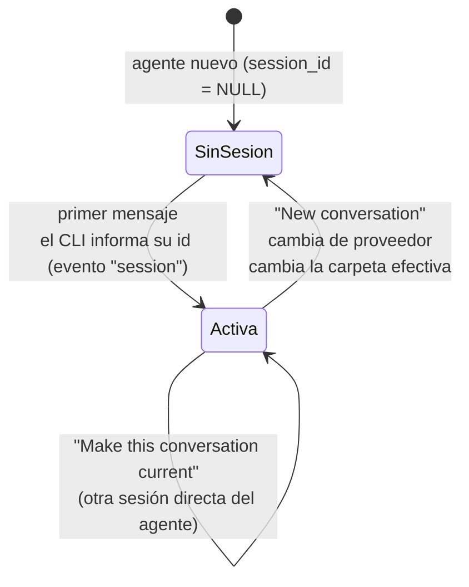

# 8. Sesiones e historial

## 8.1 Idea central

> hive-am **no guarda conversaciones**. Guarda *qué sesión nativa* usa cada agente y la vuelve a leer del almacén del CLI cuando hace falta.

Consecuencias:

- Tras un apagón, un cierre del navegador o un reinicio del servidor, abrir el agente muestra la conversación completa y el siguiente mensaje **continúa la misma sesión** (`--resume`, `-s`, `--resume-id`).
- No hay resúmenes ni "memoria" propia que mantener sincronizada.
- Puedes abrir las mismas sesiones directamente con el CLI si lo necesitas.

## 8.2 Tipos de sesión

| Tipo (`kind`) | Qué es | Puntero actual |
|---|---|---|
| `direct` | La conversación del usuario con el agente | Sí: `agents.session_id` |
| `delegation` | Sesión abierta cuando un orquestador delega una tarea al agente | No: es solo de lectura y no cambia la conversación directa |

La tabla `agent_sessions` registra **todas** (ver [documento 4](04-almacenamiento.md)).

## 8.3 Ciclo de vida de una sesión directa



Paso a paso (`runtime.ts`, función `execute`):

1. **Primer mensaje:** el agente no tiene `session_id`; se lanza el CLI sin reanudar.
2. El CLI informa su id → el runner emite `{ t: 'session', sessionId }`.
3. El runtime llama `agents.setSession(agent, id)`: guarda `session_id`, `session_cwd` (carpeta efectiva), pone `instr_hash` en `NULL` y registra la sesión en `agent_sessions` (o actualiza `last_seen`).
4. Al terminar el turno **sin error ni cancelación**, se guarda `instr_hash` (huella de las instrucciones enviadas, **sin** el texto del cuaderno) y se anota qué versión del cuaderno ya conoce la conversación. Si en el siguiente turno la huella cambió, o el cuaderno se editó fuera de la conversación, la sesión reanudada recibe las instrucciones de nuevo (en el mensaje; ver [documento 6](06-proveedores.md)).
5. **Mensajes siguientes:** se reanuda con `session_id`.

### Cuándo se abandona una sesión (y se empieza otra)

| Causa | Qué ocurre |
|---|---|
| Pulsar **New conversation** | `POST /api/agents/:id/new-session`: detiene el turno y pone `session_id = NULL`. La anterior sigue en la bitácora y se puede retomar. |
| **Cambiar el proveedor** del agente | `PATCH` descarta la sesión (un id de un CLI no sirve en otro). |
| **Cambiar la carpeta efectiva** (propia o heredada) | Al empezar el siguiente turno se compara `session_cwd` con la carpeta efectiva; si difieren, se descarta la sesión y se avisa a la interfaz. Motivo: las sesiones de Claude, OpenCode y Kiro están ligadas a su carpeta. |
| **OpenCode: carpeta registrada distinta** | Antes de reanudar, se consulta `session_v2.directory`; si no coincide con la carpeta del agente se empieza una sesión nueva (cubre sesiones creadas con versiones antiguas de hive-am). |

### Retomar una sesión anterior

En el panel de ajustes del agente, pestaña **Sessions → Conversations**: *Read transcript* (solo lectura) y *Resume this one* (`POST …/resume-session`), que cambia el puntero. Solo se pueden hacer actuales sesiones `direct`.

## 8.4 Sesiones de delegación

Cada vez que un orquestador delega (`dispatch`):

1. Se registra una fila en `dispatches` (`status = running`).
2. El worker ejecuta el turno con `source = 'dispatch'` → el runtime **fuerza sesión nueva** (`agent.session_id = null` para ese turno).
3. Al llegar el evento `session`, **no** se llama a `setSession`; se llama a `recordSession(..., 'delegation', fromId, task)` y se guarda `dispatches.session_id`.
4. El puntero `agents.session_id` del worker **no cambia**: su chat directo queda limpio, sin las tareas delegadas.
5. En la interfaz se ven en *Settings → Sessions → Delegated tasks* y en la pantalla Sessions con la etiqueta "Delegated by *X*".

Efecto buscado: el chat directo con un worker contiene solo lo que tú y él hablaron. Contra: un worker no recuerda delegaciones anteriores (el orquestador debe darle todo el contexto en cada tarea).

## 8.5 Lectores de historial

`server/src/history/index.ts` expone:

```ts
readHistory(agent: { provider, cwd, session_id }, sessionId = agent.session_id): ChatMessage[]
```

Despacha por proveedor, **atrapa cualquier error** (lo registra y devuelve `[]`) y retorna `[]` si no hay sesión.

### Formato normalizado

```ts
ChatMessage = { id, role: 'user' | 'assistant', ts: number | null, blocks: Block[], meta?: MsgMeta }

Block =
  | { type: 'text',     text }
  | { type: 'thinking', text }
  | { type: 'tool', id, name, input, output?, error?, durationMs? }

MsgMeta = { model?, usage?: Usage, cost?, costEstimated?, endTs? }
Usage   = { input, output, cacheRead, cacheWrite, reasoning, credits?, contextPct? }
```

### Claude (`history/claude.ts`)

**Ubicación:** `~/.claude/projects/<cwd codificado>/<sessionId>.jsonl`, donde el `cwd` se codifica reemplazando `/` y `.` por `-`. Si el archivo no está ahí, se busca en todas las carpetas de proyecto. El id debe cumplir `^[\w-]+$` (evita rutas maliciosas).

**Reglas de lectura:**

| Regla | Detalle |
|---|---|
| Se ignoran | Líneas que no son `user`/`assistant`, las marcadas `isMeta` y las de subagentes internos (`isSidechain`). |
| Mensajes de usuario | Si el contenido es texto y empieza por `<` (envolturas de comandos del sistema), se omite. |
| Resultados de herramienta | Un `tool_result` dentro de un mensaje de usuario **no** crea mensaje: se une al bloque `tool` correspondiente (por `tool_use_id`), con `output` y `error`. |
| Duración de herramienta | Marca de tiempo del resultado − marca de tiempo de la llamada. |
| Mensajes del asistente | Claude escribe **una línea por bloque** de contenido, todas con el mismo `message.id`; se fusionan en un solo mensaje. |
| Uso de tokens | Se toma de `message.usage`; como `output_tokens` crece durante el streaming, se conserva el **máximo**. `reasoning` sale de `output_tokens_details.thinking_tokens`. |
| Costo | Se **estima** (Claude no lo guarda): `costEstimated = true`. |
| Mensajes sin bloques | Se descartan. |

### OpenCode (`history/opencode.ts`)

**Ubicación:** `~/.local/share/opencode/opencode.db`, abierta con `better-sqlite3` en modo **solo lectura**.

- Mensajes: `SELECT … FROM session_message WHERE session_id=? AND type IN ('user','assistant') ORDER BY seq`.
- **Usuario:** texto del campo `text`. Se limpia con `stripInstructions`: se quitan las comillas literales con que OpenCode envuelve el mensaje y el bloque `<instructions …>…</instructions>`.
- **Asistente:** `content[]` con `text`, `reasoning` (→ `thinking`) y `tool` (`name`, `state.input`, `state.output` o `state.content[].text`, `state.status`, `state.time.start/end` para la duración).
- **Uso y costo:** `tokens` (`input`, `output`, `reasoning`, `cache.read`, `cache.write`); `cost` si el CLI lo reporta (si es 0, se estima); modelo `providerID/id`; `time.completed` como `endTs`.
- `opencodeSessionDir(id)`: lee `session_v2.directory` (usado para decidir si se puede reanudar).

### Kiro (`history/kiro.ts`)

**Ubicación:** `~/.kiro/sessions/cli/<sessionId>.jsonl` (mensajes) y `<sessionId>.json` (metadatos). El id debe ser un UUID.

- `Prompt` → mensaje de usuario (se limpia el bloque `<instructions …>`).
- `AssistantMessage` → asistente con bloques `text`, `thinking` y `toolUse` (si aparecen).
- `ToolResults` → se unen a su herramienta.
- **Metadatos por turno** (`.json` → `session_state.conversation_metadata.user_turn_metadatas`): créditos (`metering_usage`), tokens, modelo, % de contexto y hora de fin. Se asocian **por orden de turno** al **último** mensaje del asistente de cada turno.

> **Nota:** en las sesiones de Kiro probadas no había llamadas a herramientas guardadas, así que el mapeo de `toolUse`/`ToolResults` es de mejor esfuerzo.

## 8.6 Estadísticas de sesión (`stats.ts`)

`sessionStats(mensajes)` produce un `SessionStats` que alimenta la barra de estadísticas del chat y la lista de sesiones:

| Campo | Cálculo |
|---|---|
| `usage` | Suma de `usage` de todos los mensajes del asistente |
| `cost`, `costEstimated` | Suma de costos; `null` si ninguno tiene costo. Marcado estimado si alguna parte lo es |
| `turns` | Número de mensajes de usuario |
| `toolCalls`, `toolErrors`, `toolTimeMs` | Conteo de bloques `tool`, con error y suma de duraciones |
| `tools[]` | Por herramienta: veces, errores, tiempo total |
| `models[]` | Por modelo: mensajes y tokens de salida (se ignoran nombres que empiezan por `<`, como `<synthetic>`) |
| `lastContext` | Entrada + caché del último mensaje: con cuánto contexto arranca el siguiente turno |
| `contextPct` | % de contexto que informa el CLI (Kiro) |
| `timeline[]` | Por turno de usuario: texto del prompt, tokens, costo, duración y herramientas |
| `durationMs` | Suma de las duraciones de los turnos (**tiempo trabajando**, sin contar pausas entre mensajes) |

La duración de un turno es `endTs` del último mensaje del asistente menos el instante del mensaje del usuario.

## 8.7 Dónde se ve

| Lugar | Qué muestra |
|---|---|
| Pantalla del agente (chat) | Sesión directa actual completa + turno en vivo |
| Settings → **Sessions** (en el agente) | *Conversations* (directas, con *Current*) y *Delegated tasks* (de orquestadores) con *Read transcript* |
| Pantalla **Sessions** | Todas las sesiones de tus agentes, agrupadas por día, con búsqueda por agente/carpeta/primer mensaje y filtro por proveedor; la etiqueta indica "Current" o "Delegated by X"; muestra tokens, costo, herramientas y modelo; el panel derecho es la transcripción (solo texto) |

La pantalla Sessions muestra **solo sesiones gestionadas por hive-am**, no todas las que existan en el CLI.

## 8.8 Consideraciones

- `GET /api/sessions` y `GET /api/agents/:id/stats` **leen el historial completo** en cada llamada; con sesiones muy largas puede tardar. No hay caché.
- Los lectores son tolerantes: líneas inválidas se ignoran; archivos ausentes devuelven lista vacía.
- Los formatos de disco de los CLIs no son contratos estables; si cambian con una actualización, el lector correspondiente es el único punto a ajustar.
