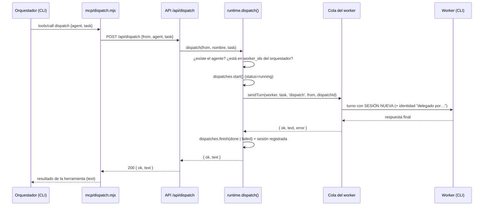

# 9. Orquestación y relaciones entre agentes

## 9.1 Modelo

- Un **orquestador** puede delegar tareas a **workers**.
- La relación es explícita y se guarda en la tabla `assignments (orchestrator_id, worker_id)`.
- **Regla fundamental:** un orquestador solo puede delegar a los workers **directamente conectados a él**, esté o no en una colonia, comparta o no colonia con ellos. La colonia no concede ni restringe delegaciones.
- Un worker puede estar conectado a varios orquestadores; un orquestador puede tener varios workers.
- Solo los agentes con `role = 'orchestrator'` pueden tener conexiones (`PUT /api/orchestrators/:id/workers` responde 400 si no lo es).

## 9.2 Cómo delega un orquestador

El orquestador recibe dos herramientas, expuestas por un **servidor MCP** (`server/mcp/dispatch.mjs`) con el nombre `hive`. El mismo servidor anuncia además las herramientas de las conexiones ([documento 14](14-conexiones-externas.md)), del cuaderno y de las skills a demanda ([7.3](07-agentes-tipos-skills-colonias.md#73-skills)) según las capacidades del agente (`HIVE_CAPS`):

| Herramienta | Qué hace |
|---|---|
| `list_agents` | Devuelve (JSON) los subagentes directos del orquestador: `name`, `role`, `description`, `provider`, `busy`. |
| `dispatch` `{ agent, task }` | Envía una tarea autocontenida a un subagente por **nombre exacto** y espera su respuesta final. |

En los CLIs aparecen como `mcp__hive__list_agents` y `mcp__hive__dispatch`.

### El servidor MCP

- Proceso Node que habla **JSON-RPC por stdio** (una línea JSON por mensaje). Implementa `initialize`, `tools/list`, `tools/call` y `ping`; ignora notificaciones; devuelve `-32601` para métodos desconocidos.
- No contiene lógica de negocio: llama a la API HTTP de hive-am.
  - `list_agents` → `GET /api/orchestrators/<HIVE_AGENT_ID>/workers`
  - `dispatch` → `POST /api/dispatch { from: HIVE_AGENT_ID, agent, task }`
- Si la API responde error, devuelve al modelo un resultado `isError` con el mensaje (p. ej. *"X is not assigned to Y"*).
- Devuelve al modelo `j.text` (la respuesta final del worker); si viene vacía: *"(the subagent finished without a text answer)"*.

### Cómo se inyecta según el proveedor

| Proveedor | Mecanismo |
|---|---|
| Claude | Archivo `~/.hive-am/mcp/<agentId>.json` + `--mcp-config` + `--allowedTools mcp__hive` |
| OpenCode | Variable de entorno `OPENCODE_CONFIG_CONTENT` con `{ mcp: { hive: { type: 'local', command: [...], environment: {...} } } }` (se fusiona con `permission.question = "deny"`, que se envía en todos los turnos; ver [documento 6](06-proveedores.md)) |
| Kiro | Perfil de agente generado `~/.kiro/agents/hive-<agentId>.json` con el servidor MCP `hive` (se reescribe en cada turno y se pasa con `--agent`); herramientas `@hive/<herramienta>` (p. ej. `@hive/dispatch`, `@hive/list_agents`) |

Las herramientas de delegación solo se anuncian cuando el agente es orquestador **y** tiene al menos un subagente (capacidad `dispatch` de `mcpCaps()`, en `instructions.ts`); el servidor MCP se inyecta si el agente tiene alguna capacidad. La configuración se regenera en cada turno, por lo que refleja siempre las conexiones actuales.

## 9.3 Flujo de una delegación



Detalles:

- **Validaciones** (`runtime.dispatch`): el orquestador debe existir; el worker se busca por nombre (sin distinguir mayúsculas) y debe estar en `worker_ids` del orquestador. Los errores vuelven como HTTP 400 y llegan al modelo como error de herramienta.
- **Sesión nueva por delegación:** cada tarea abre una sesión nativa distinta del worker, marcada como `delegation` con el orquestador y la tarea. La conversación directa del worker no cambia ([documento 8](08-sesiones-e-historial.md#84-sesiones-de-delegación)).
- **Respuesta final** (`TurnResult.text`): se toma `summary` del evento `done` (Claude lo trae en `result`) y, si no, el texto emitido **después de la última herramienta** del turno (el texto previo a una llamada a herramienta se descarta como respuesta final).
- **Bloqueo:** la petición HTTP permanece abierta hasta que el worker termina; no hay tiempo límite propio.
- **Registro:** `dispatches` guarda tarea, estado (`running` → `done`/`failed`; `interrupted` si el servidor cayó), resultado y `session_id`.

## 9.4 Cola por agente

`runtime.ts` mantiene, por agente, una cadena de promesas:

```ts
State = { chain: Promise, controller: AbortController | null, queued: number, live: Live | null }
```

- **Un solo turno a la vez por agente.** Si llega un mensaje (tuyo o una delegación) mientras hay uno en curso, se **encola** y se ejecuta después, en orden. `queued` se expone en la API y en la interfaz ("N queued").
- Agentes distintos corren en **paralelo** entre sí.
- **Stop** (`POST …/stop`) aborta solo el turno **en curso** (`SIGTERM` al CLI). Los turnos ya encolados **siguen** y se ejecutarán a continuación.
- Una delegación a un worker ocupado espera su turno en la misma cola; el orquestador queda bloqueado mientras tanto.
- Cada turno emite `turn_start`, eventos y `status` por WebSocket, y guarda `live` (eventos acumulados) para poder reconstruir la vista si el navegador recarga.

## 9.5 Instrucciones del orquestador

`composeInstructions` añade una sección **Your team** que depende del estado actual:

- **Con subagentes:** lista `- **nombre**: descripción` de **solo** los conectados; indica que son los *únicos* a los que puede delegar; le ordena delegar con `dispatch` en vez de hacer el trabajo, avisa que cada delegación abre una conversación nueva (hay que dar todo el contexto en la tarea) y que, si le preguntan por sus agentes, debe **llamar a `list_agents` y responder exactamente con lo que devuelva**, nunca con una lista antigua, y no mencionar ni usar agentes fuera de esa lista.
- **Sin subagentes:** le indica que no puede delegar y que no afirme conocer otros agentes.

**Actualización cuando cambian las conexiones:** los CLIs fijan las instrucciones cuando empieza la sesión (Claude ignora `--append-system-prompt` al reanudar; OpenCode y Kiro las reciben dentro del mensaje); por eso se compara la huella (`instr_hash`) y, si cambió el equipo (o las skills, o el cuaderno editado desde fuera), el siguiente mensaje lleva un bloque `<instructions update="true">` que sustituye al anterior ([documento 6](06-proveedores.md#66-preámbulo-de-instrucciones-providerspreamblets)).

## 9.6 Cómo se editan las relaciones en la interfaz

Hay cuatro lugares, todos usan `PUT /api/orchestrators/:id/workers` (o el campo `worker_ids` al crear/editar un orquestador):

| Lugar | Cómo |
|---|---|
| Formulario del orquestador, sección **Team** | Casillas con los workers disponibles |
| Lienzo **Relations** | Arrastrar desde el punto inferior del orquestador hasta un worker; **✕** en la línea; panel con *Disconnect* y selector *Connect…* |
| Pantalla **Colony** | Solo lectura (muestra las relaciones) |
| Creación de agentes | `worker_ids` al crear un orquestador |

### Lienzo Relations (`app/relations/page.tsx`)

Construido con React Flow (`@xyflow/react`).

- **Nodos:** un hexágono por agente. Los orquestadores tienen un *handle* de salida (abajo); los workers uno de entrada (arriba).
- **Aristas:** una por cada par orquestador→worker, con color según el **orquestador** (paleta de 8 colores) para distinguir líneas que se cruzan o convergen en un mismo worker. Si el worker está trabajando, la línea se anima.
- **Disposición automática** (`autoLayout`): orquestadores arriba y, debajo de cada uno, su fila de workers (un worker con varios orquestadores se coloca bajo el primero). Los workers sin orquestador van a la derecha. Separación: 190 px en horizontal y 280 px entre filas.
- **Posiciones propias:** al arrastrar un nodo se guarda su posición en `localStorage` (`hive-rel-pos-v2`). **Auto-arrange** borra esas posiciones y reencuadra.
- **Foco:** al pasar el mouse sobre un agente (o seleccionarlo) se resaltan sus conexiones y se atenúa el resto.
- **Quitar una conexión:** botón **✕** en el punto medio de la línea (visible al pasar el mouse sobre la línea o al enfocar el agente), o *Disconnect* en el panel del agente seleccionado. Aparece un aviso "X disconnected from Y".
- **Añadir una conexión:** arrastrar entre handles, o el selector *Connect a worker…* / *Connect to an orchestrator…* del panel.
- El panel del agente seleccionado muestra, para un orquestador, "Delegates to · N"; para un worker, "Directed by".

### Pantalla Colony (`app/page.tsx`)

Las relaciones se dibujan **encima** de las celdas del panal:

- Línea miel de cada orquestador a cada uno de sus workers, que termina en el borde de la celda, con un punto en el extremo del worker. Si el worker trabaja, la línea se anima.
- **Etiquetas** en las celdas: el orquestador muestra `↓ N` (workers) y cada worker `↑ <nombre del orquestador>` (o `↑ N` si tiene varios).
- **Hover o selección:** las conexiones del agente se vuelven gruesas; los demás agentes y líneas se atenúan.
- Las relaciones cruzan colonias sin problema, porque son independientes de ellas.

## 9.7 Qué ve el usuario de una delegación

| Dónde | Qué |
|---|---|
| Chat del orquestador | Fila **Delegate** (herramienta `dispatch`) con el worker y la tarea; al abrirla, la salida es la respuesta del worker |
| Chat del worker, mientras corre | Tarjeta **"Delegated task from X"** con la tarea; desaparece al terminar porque no pertenece a su conversación directa |
| Colony → *Recent delegations* | Últimas 6: de → a, tarea, hace cuánto, estado (verde/rojo/animado) |
| Settings → Sessions del worker | La sesión de la tarea, en *Delegated tasks* |
| Lista de agentes (selector lateral) | Mientras trabaja, el subtítulo del worker dice "Delegated task · …" |
