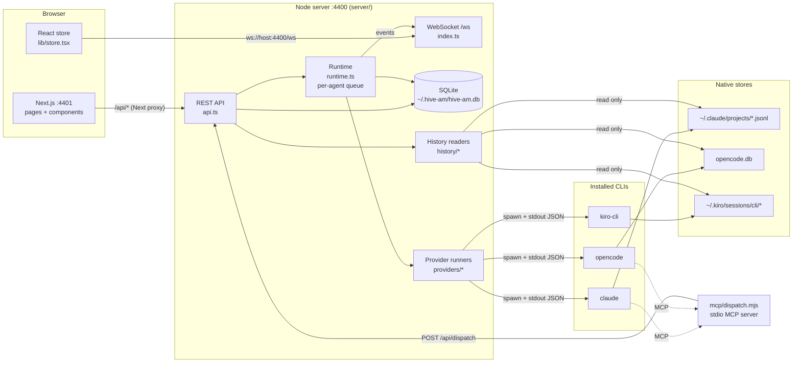

# 1. Overview

## What it is

hive-am is a local application (a Node server plus a Next.js web UI) that **manages coding-agent sessions** by running the official CLIs as child processes:

- **Claude Code** (`claude`)
- **OpenCode** (`opencode`)
- **Kiro** (`kiro-cli`)

An agent is a configuration (provider, model, prompt, permissions, folder, skills) plus a **pointer** to a native CLI session. The conversation itself is **never copied or summarized** into hive-am's database: it lives in each CLI's own store and is read back from there.

## Design principles

1. **The conversation belongs to the CLI, not to hive-am.** hive-am stores `provider + session_id + folder`. After a blackout it is enough to relaunch the CLI with `--resume`/`-s`/`--resume-id`; there are no summaries or reconstructions.
2. **No ACP.** Each turn is a `claude -p`, `opencode run` or `kiro-cli chat --no-interactive` process with line-delimited JSON output.
3. **One turn = one process.** There are no resident processes per agent. This keeps recovery simple: if hive-am goes down, nothing is left hanging except the turn in flight.
4. **History is read, not persisted.** Three readers (one per provider) normalize the native formats into a single message format.
5. **Explicit delegation.** An orchestrator can only delegate to the subagents connected directly to it. Each delegation opens a new session of the subagent.
6. **Optional inheritance through a colony.** A colony lends folder, permissions, skills and context; provider and model are never inherited.
7. **Local and single-user.** The server listens on `127.0.0.1` only and has no authentication (see [document 12](12-operations-and-troubleshooting.md)).

## Architecture

### Responsibilities by layer

| Layer | Files | Responsibility |
|---|---|---|
| Presentation | `web/` | Pages, forms, chat, honeycomb, relations canvas |
| API | `server/src/api.ts` | Validation, REST routes, orchestration of the other layers |
| Real time | `server/src/index.ts`, `runtime.ts` (`bus`) | Broadcasts events over WebSocket |
| Execution | `server/src/runtime.ts`, `instructions.ts` | Per-agent queue, sessions and delegation; composition of each agent's instructions and tools |
| Providers | `server/src/providers/` | Builds each CLI's command and translates its output into common events |
| History | `server/src/history/` | Reads the conversations stored by each CLI |
| Data | `server/src/db.ts` | SQLite schema, migrations, data access |
| MCP tools | `server/mcp/dispatch.mjs` | The `hive` server: `list_agents` and `dispatch` (orchestrators), `channel_reply`, `channel_send_file` and `channel_mute` (connections), `notebook_*` (notebook) and `skill_read` (on-demand skills) |

## Glossary

| Term | Meaning |
|---|---|
| **Agent** | A configuration plus a pointer to a native session. It can be an **orchestrator** or a **worker**. |
| **Orchestrator** (*queen*) | An agent that plans and delegates with the `dispatch` tool. |
| **Worker / subagent** | An agent that does the work; it receives tasks from the user or from an orchestrator. |
| **Agent type** | A reusable template (provider, model, prompt, permissions, skills) for creating agents. |
| **Skill** | A block of markdown instructions added to the prompt of an agent or type. |
| **Colony** | A group of agents with shared defaults (folder, permissions, skills, context). It is drawn as a region on the honeycomb. |
| **Honeycomb** (*comb*) | The hexagonal map of the Colony screen: one cell per agent. |
| **Native session** | A conversation stored by the CLI itself (identified by a `session_id`). |
| **Direct session** | The user's conversation with an agent. |
| **Delegation session** | A new session opened every time an orchestrator delegates a task. |
| **Turn** | One run of the CLI: a user message (or delegated task) and the agent's complete answer. |
| **Runner** | A function that runs a turn for a provider and produces events (`StreamEvent`). |
| **Permission** | The agent's access level: `plan` (read-only), `acceptEdits`, `bypassPermissions`. |
| **Effective folder** | The folder where the agent actually runs (its own or inherited from the colony). |

## Life of a message (summary)

1. The user types in the chat → `POST /api/agents/:id/messages`.
2. The server queues the turn in the agent's queue and answers `{ accepted: true }`.
3. The runtime resolves the effective configuration, composes the instructions and launches the provider's runner.
4. The runner starts the CLI and translates its output into events (`text`, `thinking`, `tool`, `tool_result`, `usage`, `done`, `error`).
5. Each event is broadcast over WebSocket; the browser shows them live.
6. When it finishes, the browser re-reads the native history, which already includes the complete turn.

The full detail is in [document 5](05-backend-frontend-communication.md).
