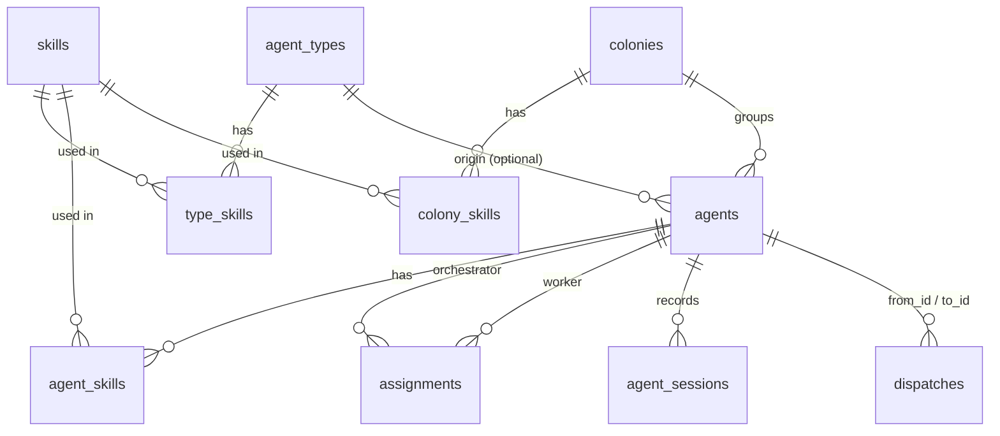

# 4. Storage

hive-am keeps data in **five** places. Understanding which one holds what is key:

| Place | Who writes it | What it contains |
|---|---|---|
| `~/.hive-am/hive-am.db` | hive-am | Configuration: agents, types, skills, colonies, relations, session pointers, delegation log |
| `~/.hive-am/mcp/<agentId>.json` | hive-am | Temporary MCP configuration per agent (Claude only) |
| `~/.hive-am/inbox/<agentId>/<date>/` | hive-am | Files people sent to an agent through a connection; deleted after 14 days ([14.6.2](14-external-connections.md#1462-received-files)) |
| Each CLI's native stores | **each CLI** | The **conversations** (messages, tools, token usage) |
| Browser `localStorage` | the UI | View preferences (theme, panel, canvas positions) |

> **Core rule:** the conversation is not copied into hive-am's database. The database only knows *which session* each agent uses.

## 4.1 SQLite database: `~/.hive-am/hive-am.db`

- Engine: `better-sqlite3` (synchronous).
- Location: `$HIVE_AM_HOME/hive-am.db` (`~/.hive-am/` by default).
- Pragmas: `journal_mode = WAL` and `foreign_keys = ON`. With WAL, `hive-am.db-wal` and `hive-am.db-shm` also appear; that is normal.
- Identifiers are text UUID v4. Dates are Unix milliseconds (`Date.now()`).
- The schema is created with `CREATE TABLE IF NOT EXISTS` when `db.ts` is imported, and then **light migrations** are applied (`ALTER TABLE … ADD COLUMN` if the column is missing). Those migrations always run, also on new databases, which is why some columns do not appear in the initial `CREATE TABLE`.

### Relationship diagram



### Table `skills`

| Column | Type | Notes |
|---|---|---|
| `id` | TEXT PK | UUID |
| `name` | TEXT, UNIQUE | Unique name |
| `description` | TEXT | One line |
| `content` | TEXT | Markdown with the instructions |
| `load` | TEXT | **Suggestion** for when the skill is assigned: `always` or `on_demand`. New ones are born `on_demand` if they exceed 2000 characters, and `always` otherwise. How it is really loaded is decided by each assignment (7.3.3) |
| `created_at`, `updated_at` | INTEGER | ms |

On install, `skills.seedDefaults` (`server/src/skills/defaults.ts`) adds **once** the skills that ship with hive-am, recording each one in `seeded_skills (slug)`. From then on they are ordinary skills: you edit or delete them, and a deleted skill is **not** recreated on the next start. If one with that name already existed, the new one is added as "Name (hive-am)". A future hive-am version that brings more skills adds them only once, and never modifies the ones you already have. Their id is `default-<slug>`. The ones that ship with hive-am are created `on_demand`, except Notebook (`always`).

### Table `agent_notebooks`

Each agent's notebook (see [7.3.2](07-agents-types-skills-colonies.md#732-the-agents-notebook)). It lives in a separate table so it does not travel with the agent list.

| Column | Type | Notes |
|---|---|---|
| `agent_id` | TEXT PK | `ON DELETE CASCADE` |
| `content` | TEXT | Markdown (max. 8000 characters) |
| `version` | INTEGER | Goes up with every change |
| `seen` | INTEGER | Last version that the agent's live conversation already contains |
| `updated_at`, `updated_by` | INTEGER, TEXT | `agent` or `user` |

### Table `agent_types`

Agent templates.

| Column | Notes |
|---|---|
| `id`, `name` (UNIQUE), `description` | |
| `role` | `orchestrator` \| `worker` |
| `provider` | `claude` \| `opencode` \| `kiro` |
| `model` | Free text; empty = the CLI's default |
| `system_prompt` | |
| `permission` | `plan` \| `acceptEdits` \| `bypassPermissions` (default `acceptEdits`) |
| `color` | Reserved; today it is only filled in the seed |
| `created_at` | |

Junction table `type_skills (type_id, skill_id, load)`, both with `ON DELETE CASCADE`. `load` (`always` / `on_demand`) is how **that** skill is loaded for that type; the same in `agent_skills` and `colony_skills`.

### Table `agents`

| Column | Notes |
|---|---|
| `id`, `name` (UNIQUE, case-insensitive when looking up by name), `description` | |
| `role` | `orchestrator` \| `worker` |
| `type_id` | FK to `agent_types`, `ON DELETE SET NULL`. Informational only: the agent is a copy, it does not follow its type |
| `provider`, `model`, `system_prompt`, `permission` | The agent's own configuration |
| `cwd` | Own folder. It can be `''` if it inherits the colony's |
| `session_id` | **Pointer** to the current direct session (the CLI's native id) |
| `session_cwd` | Folder the session was created with (migration) |
| `instr_hash` | Fingerprint of the instructions that session received (migration) |
| `status` | `idle` \| `running` \| `error` |
| `colony_id` | FK to `colonies`, `ON DELETE SET NULL` (migration) |
| `overrides` | JSON: fields where the agent ignores its colony, e.g. `["cwd","skills"]` (migration) |
| `created_at`, `updated_at` | |

Junction tables:

- `agent_skills (agent_id, skill_id, load)`: the agent's own skills (`CASCADE` on both sides).
- `assignments (orchestrator_id, worker_id)`: delegation **relations** (`CASCADE`). It is the source of truth for which orchestrator can delegate to which worker.

### Table `colonies`

| Column | Notes |
|---|---|
| `id`, `name` (UNIQUE), `color` | `color` is a hex such as `#2f8f5b` |
| `cwd` | Shared folder |
| `permission` | Shared permission |
| `system_prompt` | Shared context |
| `inherit` | JSON `{ "cwd": bool, "permission": bool, "skills": bool, "prompt": bool }`: which fields members follow by default |
| `created_at` | |

Junction table `colony_skills (colony_id, skill_id)` (`CASCADE`). Membership of agents in the colony is stored in `agents.colony_id` (an agent belongs to at most one colony).

### Table `agent_sessions`

Log of **all** the native sessions an agent has used. It feeds the Sessions tabs and screens.

| Column | Notes |
|---|---|
| `agent_id`, `session_id` | Composite primary key |
| `provider` | Provider it was created with |
| `cwd` | Effective folder it ran in |
| `first_seen`, `last_seen` | ms |
| `kind` | `direct` (the user's conversation) \| `delegation` (task from an orchestrator) |
| `from_id` | Orchestrator that delegated (only `delegation`) |
| `task` | Task text, trimmed to 500 characters (only `delegation`) |

### Table `dispatches`

Delegation log: who asked what of whom.

| Column | Notes |
|---|---|
| `id` | UUID |
| `from_id`, `to_id` | Orchestrator and worker (no foreign key: the record survives if an agent is deleted) |
| `task` | Full task text |
| `status` | `running` \| `done` \| `failed` \| `interrupted` |
| `result` | The worker's final answer, trimmed to 20,000 characters |
| `session_id` | The worker's native session where it ran (migration) |
| `created_at`, `finished_at` | |

### Initial data (seed)

`server/src/seed.ts` runs on every start but **only acts if there are no types, agents or skills**. It creates:

- Skills: `concise-reports`, `careful-reviewer`.
- Types: **Queen** (orchestrator, Claude/sonnet), **Builder** (worker, Claude/sonnet), **Reviewer** (worker, OpenCode, `plan` permission).

### Integrity and deletions

| Action | Effect |
|---|---|
| Delete an agent | Its own skills, its assignments (as orchestrator and as worker) and its session log are removed. **The native session files are not touched.** |
| Delete a colony | Its agents are left without a colony (`colony_id = NULL`) and stop inheriting. |
| Delete a type | Agents created from it keep their values; `type_id` becomes `NULL`. |
| Delete a skill | It is unlinked from agents, types and colonies. |

## 4.2 MCP configuration files: `~/.hive-am/mcp/<agentId>.json`

Only for **Claude** and only when the agent is an orchestrator with at least one subagent. It is rewritten on every turn with:

```json
{ "mcpServers": { "hive": { "command": "<node>", "args": ["…/server/mcp/dispatch.mjs"],
  "env": { "HIVE_AGENT_ID": "<id>", "HIVE_AM_API": "http://127.0.0.1:4400" } } } }
```

It is passed to Claude with `--mcp-config`. OpenCode receives the same information through the `OPENCODE_CONFIG_CONTENT` environment variable (no file is written).

## 4.3 The CLIs' native stores (read-only for hive-am)

hive-am **reads** these files to show the history; it never modifies them.

| Provider | Location | Format |
|---|---|---|
| Claude Code | `~/.claude/projects/<encoded-folder>/<sessionId>.jsonl` | JSONL, one line per content block. The encoded folder replaces `/` and `.` with `-`. If it is not found in the expected folder, all project folders are searched. |
| OpenCode | `~/.local/share/opencode/opencode.db` | SQLite, tables `session_v2` (metadata, `directory`) and `session_message` (messages). Opened in `readonly` mode. |
| Kiro | `~/.kiro/sessions/cli/<sessionId>.jsonl` and `<sessionId>.json` | `.jsonl`: messages (`Prompt`, `AssistantMessage`, …). `.json`: session metadata, including the per-turn meter (credits, duration, % of context). |

Details of each reader in [document 8](08-sessions-and-history.md).

## 4.4 Browser `localStorage`

View preferences only; if they are deleted, the UI works the same.

| Key | Value | Where it is used |
|---|---|---|
| `hive-theme` | `light` \| `dark` | `Shell.tsx`: chosen theme (if absent, the system's is followed) |
| `hive-cfg-open` | `1` \| `0` | `agents/[id]/page.tsx`: whether the agent's settings panel stays open |
| `hive-rel-pos-v2` | JSON `{ id: {x, y} }` | `relations/page.tsx`: positions of nodes you dragged by hand |
| `hive-locale` | `en` \| `es` | `lib/i18n`: UI language (never reflected in the URL) |
| `hive-git-view` | JSON `{ theme, whitespace, tabSize }` | `lib/git/gitPrefs.ts`: theme, visible whitespace and tab size of the code viewer |
| `hive-switcher-collapsed` | `1` \| `0` | `agents/[id]/page.tsx`: whether the side agent list is collapsed |

The former key `hive-rel-pos` is no longer used (it was dropped when the canvas was redesigned).

## 4.5 What is **not** stored

- Messages, answers, tool calls and their output (they are in the native store).
- Tokens and costs (computed when reading the history).
- Cookies or credentials: hive-am does not authenticate; the CLIs use their own logged-in session.
