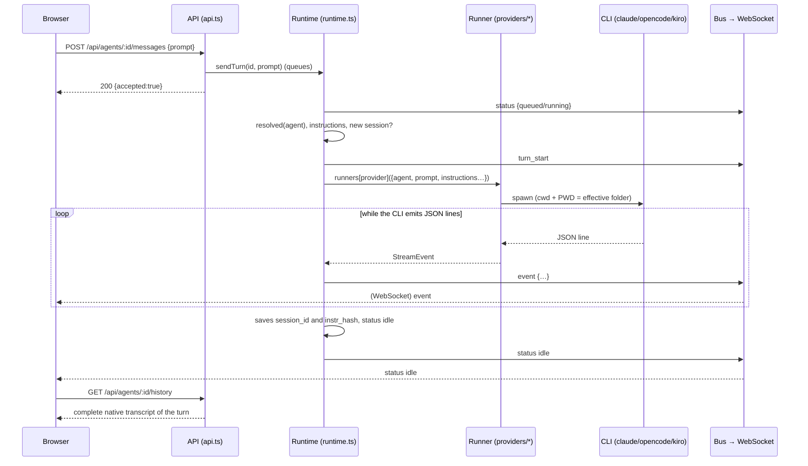

# 5. Communication between backend and frontend

The browser talks to the server through **two channels**:

| Channel | What for | Direction |
|---|---|---|
| **HTTP REST** (`/api/*`) | Read and modify data; send messages; stop turns | Request/response |
| **WebSocket** (`/ws`) | Receive live what happens (tokens, tools, status changes) | Server → browser only |

The browser **sends nothing** over the WebSocket: all actions are HTTP requests.

## 5.1 Network path

```
Browser (localhost:4401)
   │  fetch('/api/...')            ← same origin as the page
   ▼
Next.js (4401)  ── rewrites() ──▶  http://127.0.0.1:4400/api/...   (hive-am server)

Browser ── direct WebSocket ──▶ ws://<hostname>:4400/ws
```

- `web/next.config.mjs` defines a `rewrites()` that forwards `/api/:path*` to `${HIVE_AM_API}/api/:path*` (`http://127.0.0.1:4400` by default). That is why the front end calls relative paths and there are no CORS problems in normal use.
- The WebSocket **does not go through the proxy**: `lib/store.tsx` opens `ws://${location.hostname}:${NEXT_PUBLIC_HIVE_WS_PORT ?? 4400}/ws`.
- The server answers `Access-Control-Allow-Origin: *` (and methods `GET,POST,PATCH,PUT,DELETE,OPTIONS`) and replies `204` to `OPTIONS`. It is meant for local use; see security in [document 12](12-operations-and-troubleshooting.md).

## 5.2 REST API conventions

- All responses are JSON (`content-type: application/json`), error responses too.
- Success: **HTTP 200** with the resulting object (creations also return 200, not 201). Some routes return `null` when there is no data (e.g. `/live` with no turn).
- Validation error: **400** `{ "error": "message" }`. Not found: **404** `{ "error": "…" }`. Nonexistent route: **404** `{ "error": "No such route" }`. Internal failure: **500** `{ "error": "Unexpected server error" }`.
- The body must be valid JSON; otherwise 400 `Request body is not valid JSON`.
- The client (`web/lib/api.ts`) exposes `api.get/post/patch/put/del`; on a non-OK status it throws `ApiError` with the server's message, which the UI shows as is in a notice.
- The router (`api.ts`) turns `:param` into a regular-expression capture group; there are no middlewares.

## 5.3 Endpoint reference

### Health and providers

| Method and route | Response |
|---|---|
| `GET /api/health` | `{ ok: true }` |
| `GET /api/providers` | `[{ id, label, installed, version }]`. Runs `<cli> --version` (max. 8 s). 60 s cache. |
| `GET /api/providers/:p/models` | `[{ id, label }]`. 10-minute cache per provider. It may return `[]` if the CLI did not list models. |

### Agents

| Method and route | Body | Response / notes |
|---|---|---|
| `GET /api/agents` | — | List of agents with `queued` (queued messages) and `live` (is there a turn in progress?). Each agent includes `effective` (values already resolved with the colony). |
| `POST /api/agents` | `name`, `role`, `provider`, `cwd`, and optionally `description`, `model`, `system_prompt`, `permission`, `skill_ids`, `skill_loads`, `worker_ids`, `type_id`, `colony_id`, `overrides` | The created agent. 400 if the name is missing, the provider/role is invalid, the folder does not exist, the name already exists or there is no effective folder. |
| `GET /api/agents/:id` | — | One agent. |
| `PATCH /api/agents/:id` | Any subset of the fields above | The updated agent. If the `provider` changes, the current session is discarded. |
| `DELETE /api/agents/:id` | — | Stops its turn in progress and deletes it. `{ ok: true }` |
| `POST /api/agents/:id/messages` | `{ prompt }` | **Queues** the turn and answers immediately `{ accepted: true }`. The result arrives over WebSocket. |
| `POST /api/agents/:id/stop` | — | Aborts the turn in progress. `{ stopped: bool }` |
| `POST /api/agents/:id/new-session` | — | Stops the turn and clears the session pointer: the next message opens a new conversation. |
| `POST /api/agents/:id/resume-session` | `{ session_id }` | Makes a previous **direct** session of the agent the current one. 400 if it is not theirs or it is a delegation one. |
| `GET /api/agents/:id/history?session=<id>` | — | `{ session_id, messages: ChatMessage[] }`. Without `session`, uses the current one. 400 if the session does not belong to the agent. |
| `GET /api/agents/:id/stats?session=<id>` | — | `SessionStats` (see [document 10](10-chat-and-display.md)). |
| `GET /api/agents/:id/live` | — | Turn in progress `{ turnId, prompt, events[], source }` or `null`. |
| `GET /api/agents/:id/sessions` | — | Rows of `agent_sessions` (with `from_name` on delegations). |

### Sessions of all agents

| Method and route | Response |
|---|---|
| `GET /api/sessions` | All recorded sessions, plus `current`, `message_count`, `preview`, `usage`, `cost`, `tool_calls`, `model`. **Reads each session's history** on every call. |

### Changes explorer (git)

Reads: [document 13, §13.4](13-changes-explorer-git.md#134-read-api). History and actions that write (commit, pull, push, fetch, branches): [§13.8](13-changes-explorer-git.md#138-git-actions-and-history).

| Method and route | Response |
|---|---|
| `GET /api/agents/:id/git/status` | Branch, last commit and list of changes of the agent's effective folder |
| `GET /api/agents/:id/git/tree` | All files (tracked + new, without ignored) |
| `GET /api/agents/:id/git/diff?path=&old=` | Unified diff of a file against `HEAD` |
| `GET /api/agents/:id/git/file?path=` | Content of a file (or its `HEAD` version if it was deleted) |
| `GET /api/agents/:id/git/raw?path=` | Bytes of an image for the preview |

### Skills

| Method and route | Body | Response |
|---|---|---|
| `GET /api/skills` | — | List |
| `GET /api/skills/usage` | — | `{ [skillId]: { agents, types } }` (counts agents and types that use it; does **not** count colonies) |
| `POST /api/skills` | `{ name, description?, content?, load? }` | The skill (`load`: **suggested** mode when assigning it). 400 if the name exists. |
| `PATCH /api/skills/:id` | subset | The skill |
| `DELETE /api/skills/:id` | — | `{ ok: true }` |
| `POST /api/skills/read` | `{ from, name }` | Used by the `hive` MCP (`skill_read`): `{ name, content }` of a skill that agent `from` has; 400 with the list of its skills if the name does not exist |
| `GET /api/agents/:id/notebook` | — | `{ content, version, size, max, updated_at, updated_by, enabled }` (`enabled`: the agent has the Notebook skill) |
| `PUT /api/agents/:id/notebook` | `{ content, version? }` | User edit. 400 if it exceeds 8000 characters or if `version` is no longer the current one (the agent wrote in the meantime). Local origin only. |
| `POST /api/notebook/read` · `/add` · `/rewrite` | `{ from, … }` | Used by the `hive` MCP (`notebook_read`, `notebook_add`, `notebook_rewrite`) |

### Agent types

| Method and route | Body | Response |
|---|---|---|
| `GET /api/types` | — | List (each type with `skill_ids` and `skill_loads`) |
| `POST /api/types` | `name`, `role`, `provider` and optionally `description`, `model`, `system_prompt`, `permission`, `skill_ids`, `skill_loads` | The type |
| `PATCH /api/types/:id` | subset | The type |
| `DELETE /api/types/:id` | — | `{ ok: true }` |
| `POST /api/types/:id/spawn` | `{ name, cwd?, description?, colony_id? }` | Creates an **agent** copying the type's values |

### Colonies

| Method and route | Body | Response |
|---|---|---|
| `GET /api/colonies` | — | List (with `skill_ids`, `skill_loads`, `agent_ids`, `inherit`) |
| `POST /api/colonies` | `name`, and optionally `color`, `cwd`, `permission`, `system_prompt`, `skill_ids`, `skill_loads`, `inherit`, `agent_ids` | The colony |
| `PATCH /api/colonies/:id` | subset; `agent_ids` **replaces** the membership | The colony |
| `DELETE /api/colonies/:id` | — | `{ ok: true }` |

### Orchestration

| Method and route | Body | Response |
|---|---|---|
| `GET /api/orchestrators/:id/workers` | — | `[{ name, role, description, provider, busy }]`: only the **direct** subagents (used by the `list_agents` tool) |
| `PUT /api/orchestrators/:id/workers` | `{ worker_ids }` | Replaces the orchestrator's connections. 400 if the agent is not an orchestrator. |
| `POST /api/dispatch` | `{ from, agent, task }` | **Blocks** until the worker finishes. Returns `{ ok, text, error? }`. 400 if it does not exist, is not assigned, etc. |
| `GET /api/dispatches` | — | Last 50 delegations |

### Utilities

| Method and route | Response |
|---|---|
| `GET /api/fs/dirs?path=<path>` | `{ path, parent, dirs: [{ name, path }] }` for the folder picker (hides folders starting with `.` and `node_modules`; without `path` it uses your home folder). |

## 5.4 WebSocket: `ws://<host>:4400/ws`

Each message is a JSON object with a `kind` field. They are produced by the runtime's `bus` (`runtime.ts`).

| `kind` | Fields | When it is emitted |
|---|---|---|
| `turn_start` | `agentId`, `turnId`, `prompt`, `source` (`user` \| `dispatch`), `from?` | When a turn starts running (not when it is queued). |
| `event` | `agentId`, `turnId`, `event` (a `StreamEvent`) | For each event the runner produces. |
| `status` | `agentId`, `status` (`idle` \| `running` \| `error` \| `queued`), `queued` | When queuing, when starting and when finishing a turn. |
| `agents_changed` | — | When the set of agents/colonies or a session changes (creation, edit, deletion, new session, etc.). |

### Turn events (`StreamEvent`)

They are common to the three providers (each runner translates its own format):

| `t` | Fields | Meaning |
|---|---|---|
| `session` | `sessionId` | The CLI reported its session id (stored as the pointer). |
| `text` | `delta` | Fragment of the answer text. |
| `thinking` | `delta` | Fragment of reasoning. |
| `tool` | `id`, `name`, `input` | The agent invokes a tool. |
| `tool_result` | `id`, `output`, `error?` | Result of that tool. |
| `usage` | `usage` (partial), `cost?`, `model?`, `durationMs?` | Token/credit usage and cost. |
| `done` | `ok`, `summary?` | Successful end. |
| `error` | `message` | End with an error. |

## 5.5 Full flow of a message



Important points:

1. **The HTTP response of the POST does not contain the agent's answer**; it only confirms it was queued.
2. The browser paints the turn live from the WebSocket events. It is a temporary state (`LiveTurn`).
3. When `status: idle` (or `error`) arrives, the store increments a `finished[agentId]` counter. The chat reacts by reading `GET …/history`: the native transcript replaces the temporary state.
4. If the turn ends in `error`, the live state is **kept** so you can see the message, until you press *Dismiss*.

## 5.6 State in the browser (`lib/store.tsx`)

`HiveProvider` keeps in a reducer:

```
ready, connected,
agents[], types[], skills[], colonies[], providers[],
live: { [agentId]: LiveTurn },       // turn in progress
finished: { [agentId]: number }      // counter of finished turns
```

| Moment | What happens |
|---|---|
| Mount | `refresh()` loads agents, types, skills and colonies; providers are requested separately. |
| WebSocket open | `refresh(['agents'])`; then, for each agent with `live: true`, `GET /live` is requested and the turn is **rebuilt** with its accumulated events. That way, reloading the page in the middle of a turn does not lose what was already shown. |
| `agents_changed` | `refresh(['agents','colonies'])`. |
| `turn_start` | Creates an empty `LiveTurn` for that agent. |
| `event` | Folds the event into the `LiveTurn` (see [document 10](10-chat-and-display.md)). Ignores events with a `turnId` different from the current one. |
| `status` | Updates the agent's status and queue. `queued` is shown as `running`. On `idle` it clears the `LiveTurn` and, if there was one, bumps `finished`; on `error` it keeps it. |
| Socket close | `connected = false`; retries with exponential backoff: `min(8000, 800 · 2^n)` ms. |

The connection status is shown at the bottom of the sidebar ("Connected to server" / "Server offline — retrying").

## 5.7 How the interface stays fresh

- Changes made from this tab, or another one, arrive as `agents_changed` and force a `refresh`.
- Screens that do not listen to events directly (e.g. *Recent delegations* in Colony) poll: `GET /api/dispatches` every 6 s.
- The provider list is requested once; the server caches it for 60 s.
