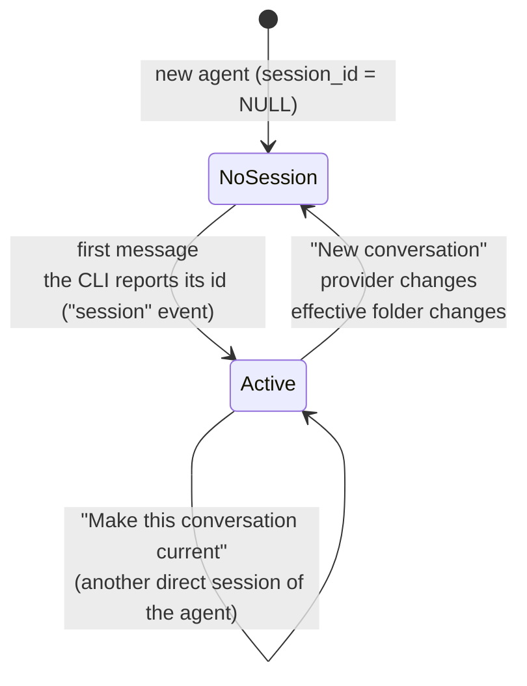

# 8. Sessions and history

## 8.1 Core idea

> hive-am **does not store conversations**. It stores *which native session* each agent uses and re-reads it from the CLI's store when needed.

Consequences:

- After a blackout, a browser close or a server restart, opening the agent shows the complete conversation and the next message **continues the same session** (`--resume`, `-s`, `--resume-id`).
- There are no summaries or own "memory" to keep in sync.
- You can open the same sessions directly with the CLI if you need to.

## 8.2 Session types

| Type (`kind`) | What it is | Current pointer |
|---|---|---|
| `direct` | The user's conversation with the agent | Yes: `agents.session_id` |
| `delegation` | Session opened when an orchestrator delegates a task to the agent | No: it is read-only and does not change the direct conversation |

The `agent_sessions` table records **all** of them (see [document 4](04-storage.md)).

## 8.3 Life cycle of a direct session



Step by step (`runtime.ts`, function `execute`):

1. **First message:** the agent has no `session_id`; the CLI is launched without resuming.
2. The CLI reports its id → the runner emits `{ t: 'session', sessionId }`.
3. The runtime calls `agents.setSession(agent, id)`: it stores `session_id`, `session_cwd` (effective folder), sets `instr_hash` to `NULL` and records the session in `agent_sessions` (or updates `last_seen`).
4. When the turn ends **without error or cancellation**, `instr_hash` is stored (fingerprint of the instructions sent, **without** the notebook text) and it is noted which notebook version the conversation already knows. If on the next turn the fingerprint changed, or the notebook was edited outside the conversation, the resumed session receives the instructions again (in the message; see [document 6](06-providers.md)).
5. **Following messages:** resumed with `session_id`.

### When a session is abandoned (and another started)

| Cause | What happens |
|---|---|
| Pressing **New conversation** | `POST /api/agents/:id/new-session`: stops the turn and sets `session_id = NULL`. The previous one stays in the log and can be resumed. |
| **Changing the agent's provider** | `PATCH` discards the session (one CLI's id is no use in another). |
| **Changing the effective folder** (own or inherited) | When the next turn starts, `session_cwd` is compared with the effective folder; if they differ, the session is discarded and the UI is notified. Reason: Claude, OpenCode and Kiro sessions are tied to their folder. |
| **OpenCode: different recorded folder** | Before resuming, `session_v2.directory` is checked; if it does not match the agent's folder a new session is started (covers sessions created with old hive-am versions). |

### Resuming a previous session

In the agent's settings panel, **Sessions → Conversations** tab: *Read transcript* (read-only) and *Resume this one* (`POST …/resume-session`), which changes the pointer. Only `direct` sessions can be made current.

## 8.4 Delegation sessions

Every time an orchestrator delegates (`dispatch`):

1. A row is recorded in `dispatches` (`status = running`).
2. The worker runs the turn with `source = 'dispatch'` → the runtime **forces a new session** (`agent.session_id = null` for that turn).
3. When the `session` event arrives, `setSession` is **not** called; `recordSession(..., 'delegation', fromId, task)` is called and `dispatches.session_id` is stored.
4. The worker's `agents.session_id` pointer **does not change**: its direct chat stays clean, without the delegated tasks.
5. In the UI they appear in *Settings → Sessions → Delegated tasks* and in the Sessions screen with the "Delegated by *X*" label.

Intended effect: the direct chat with a worker contains only what you and it talked about. Downside: a worker does not remember previous delegations (the orchestrator must give it all the context in each task).

## 8.5 History readers

`server/src/history/index.ts` exposes:

```ts
readHistory(agent: { provider, cwd, session_id }, sessionId = agent.session_id): ChatMessage[]
```

It dispatches by provider, **catches any error** (logs it and returns `[]`) and returns `[]` if there is no session.

### Normalized format

```ts
ChatMessage = { id, role: 'user' | 'assistant', ts: number | null, blocks: Block[], meta?: MsgMeta }

Block =
  | { type: 'text',     text }
  | { type: 'thinking', text }
  | { type: 'tool', id, name, input, output?, error?, durationMs? }

MsgMeta = { model?, usage?: Usage, cost?, costEstimated?, endTs? }
Usage   = { input, output, cacheRead, cacheWrite, reasoning, credits?, contextPct? }
```

### Claude (`history/claude.ts`)

**Location:** `~/.claude/projects/<encoded cwd>/<sessionId>.jsonl`, where the `cwd` is encoded by replacing `/` and `.` with `-`. If the file is not there, all project folders are searched. The id must match `^[\w-]+$` (prevents malicious paths).

**Reading rules:**

| Rule | Detail |
|---|---|
| Ignored | Lines that are not `user`/`assistant`, those marked `isMeta` and those from internal subagents (`isSidechain`). |
| User messages | If the content is text and starts with `<` (system command wrappers), it is skipped. |
| Tool results | A `tool_result` inside a user message does **not** create a message: it is joined to the matching `tool` block (by `tool_use_id`), with `output` and `error`. |
| Tool duration | Timestamp of the result − timestamp of the call. |
| Assistant messages | Claude writes **one line per content block**, all with the same `message.id`; they are merged into a single message. |
| Token usage | Taken from `message.usage`; since `output_tokens` grows during streaming, the **maximum** is kept. `reasoning` comes from `output_tokens_details.thinking_tokens`. |
| Cost | **Estimated** (Claude does not store it): `costEstimated = true`. |
| Messages without blocks | Discarded. |

### OpenCode (`history/opencode.ts`)

**Location:** `~/.local/share/opencode/opencode.db`, opened with `better-sqlite3` in **read-only** mode.

- Messages: `SELECT … FROM session_message WHERE session_id=? AND type IN ('user','assistant') ORDER BY seq`.
- **User:** text of the `text` field. It is cleaned with `stripInstructions`: the literal quotes OpenCode wraps the message in and the `<instructions …>…</instructions>` block are removed.
- **Assistant:** `content[]` with `text`, `reasoning` (→ `thinking`) and `tool` (`name`, `state.input`, `state.output` or `state.content[].text`, `state.status`, `state.time.start/end` for the duration).
- **Usage and cost:** `tokens` (`input`, `output`, `reasoning`, `cache.read`, `cache.write`); `cost` if the CLI reports it (if 0, it is estimated); model `providerID/id`; `time.completed` as `endTs`.
- `opencodeSessionDir(id)`: reads `session_v2.directory` (used to decide whether it can be resumed).

### Kiro (`history/kiro.ts`)

**Location:** `~/.kiro/sessions/cli/<sessionId>.jsonl` (messages) and `<sessionId>.json` (metadata). The id must be a UUID.

- `Prompt` → user message (the `<instructions …>` block is cleaned).
- `AssistantMessage` → assistant with `text`, `thinking` and `toolUse` blocks (if they appear).
- `ToolResults` → joined to their tool.
- **Per-turn metadata** (`.json` → `session_state.conversation_metadata.user_turn_metadatas`): credits (`metering_usage`), tokens, model, % of context and end time. They are associated **by turn order** with the **last** assistant message of each turn.

> **Note:** in the Kiro sessions tested there were no stored tool calls, so the mapping of `toolUse`/`ToolResults` is best-effort.

## 8.6 Session statistics (`stats.ts`)

`sessionStats(messages)` produces a `SessionStats` that feeds the chat's statistics bar and the session list:

| Field | Computation |
|---|---|
| `usage` | Sum of `usage` of all assistant messages |
| `cost`, `costEstimated` | Sum of costs; `null` if none has a cost. Marked estimated if any part is |
| `turns` | Number of user messages |
| `toolCalls`, `toolErrors`, `toolTimeMs` | Count of `tool` blocks, with error, and sum of durations |
| `tools[]` | Per tool: times, errors, total time |
| `models[]` | Per model: messages and output tokens (names starting with `<`, such as `<synthetic>`, are ignored) |
| `lastContext` | Input + cache of the last message: how much context the next turn starts with |
| `contextPct` | % of context reported by the CLI (Kiro) |
| `timeline[]` | Per user turn: prompt text, tokens, cost, duration and tools |
| `durationMs` | Sum of the turns' durations (**time working**, not counting pauses between messages) |

A turn's duration is the last assistant message's `endTs` minus the instant of the user message.

## 8.7 Where it is shown

| Place | What it shows |
|---|---|
| Agent screen (chat) | Complete current direct session + live turn |
| Settings → **Sessions** (on the agent) | *Conversations* (direct, with *Current*) and *Delegated tasks* (from orchestrators) with *Read transcript* |
| **Sessions** screen | All your agents' sessions, grouped by day, with search by agent/folder/first message and a provider filter; the label says "Current" or "Delegated by X"; it shows tokens, cost, tools and model; the right panel is the transcript (text only) |

The Sessions screen shows **only sessions managed by hive-am**, not every one that exists in the CLI.

## 8.8 Considerations

- `GET /api/sessions` and `GET /api/agents/:id/stats` **read the full history** on every call; with very long sessions it can be slow. There is no cache.
- The readers are tolerant: invalid lines are ignored; missing files return an empty list.
- The CLIs' on-disk formats are not stable contracts; if they change with an update, the corresponding reader is the only point to adjust.
