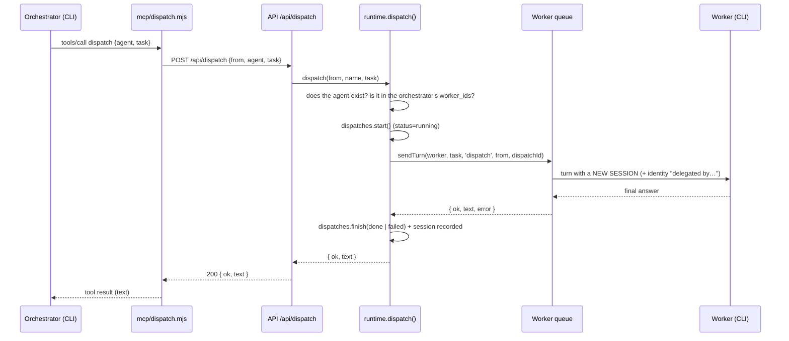

# 9. Orchestration and relations between agents

## 9.1 Model

- An **orchestrator** can delegate tasks to **workers**.
- The relation is explicit and stored in the `assignments (orchestrator_id, worker_id)` table.
- **Fundamental rule:** an orchestrator can only delegate to the workers **directly connected to it**, whether or not it is in a colony and whether or not it shares a colony with them. The colony neither grants nor restricts delegations.
- A worker can be connected to several orchestrators; an orchestrator can have several workers.
- Only agents with `role = 'orchestrator'` can have connections (`PUT /api/orchestrators/:id/workers` answers 400 if it is not one).

## 9.2 How an orchestrator delegates

The orchestrator receives two tools, exposed by an **MCP server** (`server/mcp/dispatch.mjs`) named `hive`. The same server also announces the tools of connections ([document 14](14-external-connections.md)), of the notebook and of on-demand skills ([7.3](07-agents-types-skills-colonies.md#73-skills)) according to the agent's capabilities (`HIVE_CAPS`):

| Tool | What it does |
|---|---|
| `list_agents` | Returns (JSON) the orchestrator's direct subagents: `name`, `role`, `description`, `provider`, `busy`. |
| `dispatch` `{ agent, task }` | Sends a self-contained task to a subagent by **exact name** and waits for its final answer. |

In the CLIs they appear as `mcp__hive__list_agents` and `mcp__hive__dispatch`.

### The MCP server

- A Node process that speaks **JSON-RPC over stdio** (one JSON line per message). It implements `initialize`, `tools/list`, `tools/call` and `ping`; it ignores notifications; it returns `-32601` for unknown methods.
- It contains no business logic: it calls hive-am's HTTP API.
  - `list_agents` → `GET /api/orchestrators/<HIVE_AGENT_ID>/workers`
  - `dispatch` → `POST /api/dispatch { from: HIVE_AGENT_ID, agent, task }`
- If the API answers with an error, it returns an `isError` result with the message to the model (e.g. *"X is not assigned to Y"*).
- It returns `j.text` to the model (the worker's final answer); if it is empty: *"(the subagent finished without a text answer)"*.

### How it is injected depending on the provider

| Provider | Mechanism |
|---|---|
| Claude | File `~/.hive-am/mcp/<agentId>.json` + `--mcp-config` + `--allowedTools mcp__hive` |
| OpenCode | `OPENCODE_CONFIG_CONTENT` environment variable with `{ mcp: { hive: { type: 'local', command: [...], environment: {...} } } }` (merged with `permission.question = "deny"`, which is sent on every turn; see [document 6](06-providers.md)) |
| Kiro | Generated agent profile `~/.kiro/agents/hive-<agentId>.json` with the `hive` MCP server (rewritten on every turn and passed with `--agent`); tools `@hive/<tool>` (e.g. `@hive/dispatch`, `@hive/list_agents`) |

The delegation tools are only announced when the agent is an orchestrator **and** has at least one subagent (`dispatch` capability of `mcpCaps()`, in `instructions.ts`); the MCP server is injected if the agent has any capability. The configuration is regenerated on every turn, so it always reflects the current connections.

## 9.3 Flow of a delegation



Details:

- **Validations** (`runtime.dispatch`): the orchestrator must exist; the worker is looked up by name (case-insensitive) and must be in the orchestrator's `worker_ids`. Errors come back as HTTP 400 and reach the model as a tool error.
- **New session per delegation:** each task opens a different native session of the worker, marked `delegation` with the orchestrator and the task. The worker's direct conversation does not change ([document 8](08-sessions-and-history.md#84-delegation-sessions)).
- **Final answer** (`TurnResult.text`): `summary` of the `done` event is taken (Claude brings it in `result`) and, failing that, the text emitted **after the last tool** of the turn (text before a tool call is discarded as a final answer).
- **Blocking:** the HTTP request stays open until the worker finishes; there is no timeout of its own.
- **Log:** `dispatches` stores task, status (`running` → `done`/`failed`; `interrupted` if the server went down), result and `session_id`.

## 9.4 Per-agent queue

`runtime.ts` keeps, per agent, a chain of promises:

```ts
State = { chain: Promise, controller: AbortController | null, queued: number, live: Live | null }
```

- **One turn at a time per agent.** If a message (yours or a delegation) arrives while one is in progress, it is **queued** and run afterwards, in order. `queued` is exposed in the API and the UI ("N queued").
- Different agents run **in parallel** with each other.
- **Stop** (`POST …/stop`) aborts only the turn **in progress** (`SIGTERM` to the CLI). Turns already queued **continue** and will run next.
- A delegation to a busy worker waits its turn in the same queue; the orchestrator stays blocked meanwhile.
- Each turn emits `turn_start`, events and `status` over WebSocket, and keeps `live` (accumulated events) so the view can be rebuilt if the browser reloads.

## 9.5 Orchestrator instructions

`composeInstructions` adds a **Your team** section that depends on the current state:

- **With subagents:** a `- **name**: description` list of **only** the connected ones; it says they are the *only* ones it can delegate to; it tells it to delegate with `dispatch` instead of doing the work, warns that each delegation opens a new conversation (all the context must be given in the task) and that, if asked about its agents, it must **call `list_agents` and answer exactly with what it returns**, never with an old list, and not mention or use agents outside that list.
- **Without subagents:** it tells it that it cannot delegate and not to claim to know other agents.

**Update when connections change:** the CLIs fix the instructions when the session starts (Claude ignores `--append-system-prompt` on resume; OpenCode and Kiro receive them inside the message); that is why the fingerprint (`instr_hash`) is compared and, if the team changed (or the skills, or the notebook edited from outside), the next message carries an `<instructions update="true">` block that replaces the previous one ([document 6](06-providers.md#66-instructions-preamble-providerspreamblets)).

## 9.6 How relations are edited in the UI

There are four places; all use `PUT /api/orchestrators/:id/workers` (or the `worker_ids` field when creating/editing an orchestrator):

| Place | How |
|---|---|
| Orchestrator form, **Team** section | Checkboxes with the available workers |
| **Relations** canvas | Drag from the orchestrator's bottom point to a worker; **✕** on the line; panel with *Disconnect* and a *Connect…* selector |
| **Colony** screen | Read-only (shows the relations) |
| Agent creation | `worker_ids` when creating an orchestrator |

### Relations canvas (`app/relations/page.tsx`)

Built with React Flow (`@xyflow/react`).

- **Nodes:** one hexagon per agent. Orchestrators have an output *handle* (bottom); workers have an input one (top).
- **Edges:** one per orchestrator→worker pair, colored by **orchestrator** (palette of 8 colors) to tell apart lines that cross or converge on the same worker. If the worker is working, the line is animated.
- **Automatic layout** (`autoLayout`): orchestrators on top and, below each one, its row of workers (a worker with several orchestrators is placed under the first). Workers without an orchestrator go to the right. Spacing: 190 px horizontally and 280 px between rows.
- **Own positions:** when dragging a node its position is saved in `localStorage` (`hive-rel-pos-v2`). **Auto-arrange** deletes those positions and reframes.
- **Focus:** hovering over an agent (or selecting it) highlights its connections and dims the rest.
- **Removing a connection:** **✕** button at the midpoint of the line (visible when hovering the line or focusing the agent), or *Disconnect* in the selected agent's panel. A notice "X disconnected from Y" appears.
- **Adding a connection:** drag between handles, or the *Connect a worker…* / *Connect to an orchestrator…* selector in the panel.
- The selected agent's panel shows, for an orchestrator, "Delegates to · N"; for a worker, "Directed by".

### Colony screen (`app/page.tsx`)

Relations are drawn **on top of** the honeycomb cells:

- A honey-colored line from each orchestrator to each of its workers, ending at the cell's edge, with a dot at the worker's end. If the worker is working, the line is animated.
- **Labels** on the cells: the orchestrator shows `↓ N` (workers) and each worker `↑ <orchestrator name>` (or `↑ N` if it has several).
- **Hover or selection:** the agent's connections become thick; the other agents and lines are dimmed.
- Relations cross colonies without problem, because they are independent of them.

## 9.7 What the user sees of a delegation

| Where | What |
|---|---|
| Orchestrator's chat | **Delegate** row (`dispatch` tool) with the worker and the task; when opened, the output is the worker's answer |
| Worker's chat, while it runs | **"Delegated task from X"** card with the task; it disappears when it finishes because it does not belong to its direct conversation |
| Colony → *Recent delegations* | Last 6: from → to, task, how long ago, status (green/red/animated) |
| Worker's Settings → Sessions | The task's session, in *Delegated tasks* |
| Agent list (side selector) | While it works, the worker's subtitle says "Delegated task · …" |
